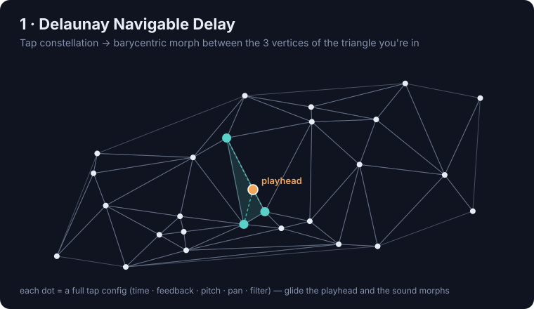
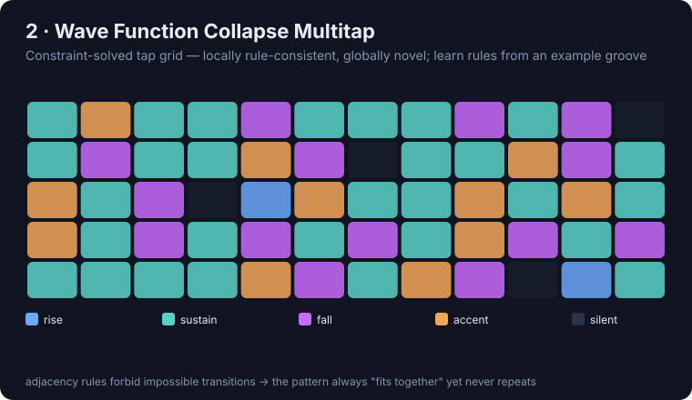
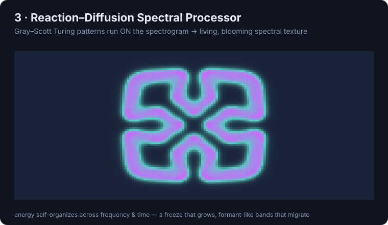
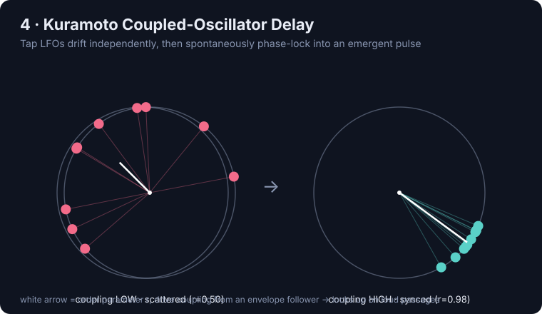
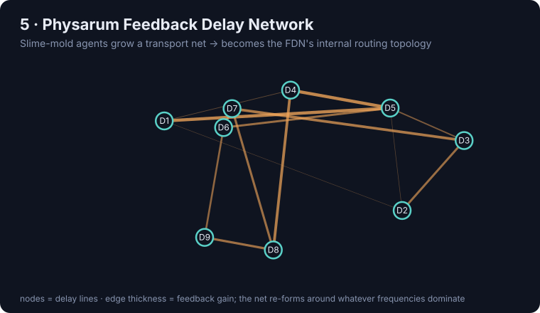
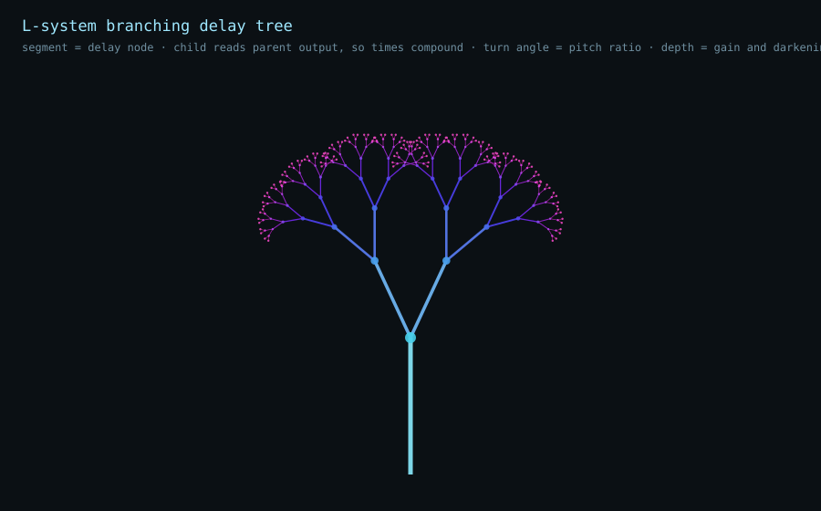

# Unconventional Systems for a New Max for Live Effect

Delays and effect+delay hybrids built on **exotic math and algorithms** — computational
geometry, constraint solvers, reaction–diffusion, coupled oscillators, self-organizing
agents — mapped onto audio DSP. The goal: architectures that *don't exist yet* as audio
tools, in the spirit of the Waldorf Iridium's non-conventional synthesis engines (only
here for **processing**, not generation).

> **The meta-architecture (true for every idea below):**
> Run the exotic generative/structural algorithm **at control rate** (Jitter matrices, JS,
> or `node.script`), **sample its state**, and use it to drive a *bank* of DSP nodes —
> delay taps, comb filters, grains, feedback junctions — in `gen~`/`poly~`.
> The weird math builds the **architecture**; `gen~` renders it.

Each concept has: an SVG diagram (`assets/img/`) and a numpy audio sketch (`assets/audio/`)
that approximates the sonic direction. **Dry reference:** [`assets/audio/00_dry_source.wav`](assets/audio/00_dry_source.wav)
— a short marimba phrase that every demo processes.

---

## 1 · Delaunay Navigable Delay — a *navigable* delay space



🔊 [`assets/audio/01_delaunay_navigable_delay.wav`](assets/audio/01_delaunay_navigable_delay.wav)
&nbsp;·&nbsp; ▶ **Live prototype:** [`prototypes/delaunay_delay.html`](prototypes/delaunay_delay.html) — real Bowyer–Watson triangulation, barycentric morph + Voronoi freeze (write-up in the prototyping section below).

- **Math:** Scatter N delay taps as points in a plane; each carries a full config (time,
  feedback, pitch, pan, filter). Compute the **Delaunay triangulation**. A moving
  "playhead" sits inside a triangle → its **barycentric coordinates** give three weights
  summing to 1 → interpolate the three vertex configs continuously.
- **Sound:** Drive the playhead with an LFO / envelope follower / mouse and you *glide*
  across a constellation of delay behaviors. Cross an edge and a new tap smoothly swaps in.
  The **Voronoi dual** gives hard-switching regions for gating/routing.
- **Why novel:** Multitap delays are static tap lists. This is a continuous, topologically
  structured *morph space* with well-defined neighbor relationships. Use **Bowyer–Watson
  incremental insertion** to add/kill taps live.
- **Build:** Geometry in JS or `jit.gen` → barycentric weights → `poly~` of delay voices.
- **Effort:** Low. Fastest path to a working `.amxd`.

## 2 · Wave Function Collapse Multitap — teach it a groove, it hallucinates infinite coherent ones



🔊 [`assets/audio/02_wfc_multitap.wav`](assets/audio/02_wfc_multitap.wav)
&nbsp;·&nbsp; ▶ **Live prototype:** [`prototypes/wfc_multitap.html`](prototypes/wfc_multitap.html) — real animated WFC solver, learn-from-example, grain + gated-multitap engines (write-up in the prototyping section below).
&nbsp;·&nbsp; 📱 **Mobile prototype:** [`prototypes/wfc_chassis.html`](prototypes/wfc_chassis.html) — the same engine on the DLNY phone chassis, portrait-only.

- **Math:** Grid = time-steps × tap-lanes. "Tiles" = tap states (`rise`, `sustain`, `fall`,
  `accent`, `silent`, `feedback-junction`). **Adjacency constraints** enforce musical logic.
  Collapse solves a pattern that's locally rule-consistent but globally surprising; re-seed
  → an endless family of coherent variations.
- **Killer feature — overlapping model:** Feed WFC an *example* pattern (tap a rhythm, or
  analyze an incoming loop) and it **learns the adjacency rules from that example**, then
  generates new multitap patterns *in that style*.
- **Build:** WFC solver in JS/`node.script` (cheap constraint-propagation loop) → matrix →
  read cells to set tap gains/pitches in `gen~`. Animate the collapse so the pattern
  audibly *crystallizes*.
- **Effort:** Low–medium. Best *story*; the learn-from-example hook is the selling point.

## 3 · Reaction–Diffusion Spectral Processor — living, blooming spectral texture



🔊 [`assets/audio/03_reaction_diffusion_spectral.wav`](assets/audio/03_reaction_diffusion_spectral.wav)

- **Math:** Treat the STFT magnitude spectrogram as a **chemical concentration field**. Run
  **Gray–Scott reaction–diffusion** on it. Turing patterns emerge — stripes, spots, blooming
  fronts. Feed the input into the concentrations, resynthesize the diffused field.
- **Sound:** Energy self-organizes and smears across frequency and time — a spectral freeze
  that *grows*, formant-like bands that migrate, organic bloom on transients. Closest in
  character to the Iridium's "kernels."
- **Build:** This is what **Jitter is for.** Spectrogram in a `jit.matrix`; the RD update as
  a `jit.gen`/`jit.pix` shader (two feedback matrices + a Laplacian kernel — trivial on GPU);
  resynth via `pfft~` or `gen~` FFT.
- **Effort:** Medium. Highest texture payoff.

## 4 · Kuramoto Coupled-Oscillator Delay — self-organizing polyrhythm



🔊 [`assets/audio/04_kuramoto_delay.wav`](assets/audio/04_kuramoto_delay.wav)

- **Math:** A bank of phase oscillators (tap-time modulators / LFOs) that are **coupled**.
  Below a threshold they drift; above it they **spontaneously synchronize** — or form
  partial clusters ("chimera states": half locked, half chaotic).
- **Sound:** Taps whose timing phase-locks into an emergent groove, then dissolves back into
  chaos as coupling drops. Wire coupling to an envelope follower → it locks up on loud
  passages, scatters on quiet ones. (The demo ramps coupling up over its length so you hear
  scatter → lock.)
- **Build:** N phase integrators in `gen~` with an all-to-all coupling term; phases modulate
  tap read positions. Cheap and sample-accurate.
- **Effort:** Low–medium.

## 5 · Physarum Feedback Delay Network — a room that grows its own geometry



🔊 [`assets/audio/05_physarum_fdn.wav`](assets/audio/05_physarum_fdn.wav)
&nbsp;·&nbsp; ▶ **Live prototype:** [`prototypes/physarum_fdn.html`](prototypes/physarum_fdn.html) — real agent sim, spectral seeding, and a full 8-node mesh whose live trail density *is* each edge's routing gain (write-up in the prototyping section below).

- **Math:** Thousands of agents crawl a 2D field, deposit trails, steer toward stronger
  trails (the slime-mold sim that solves mazes and builds transport networks). Seed the field
  with the input's spectral energy.
- **Sound:** The trail map *becomes the routing/feedback topology* of a **Feedback Delay
  Network**. The reverb/delay's internal structure self-organizes toward dominant
  frequencies, then reconfigures as the input changes. (The static-audio demo above uses a
  fixed Hadamard FDN as a stand-in; the live prototype implements the real thing — no self-loops,
  8 delay lines routed only through each other, gain set every frame by the trail between them.)
- **Build:** Agents in `jit.gen` (GPU particle sim) → sample density map → set the FDN mixing
  matrix in `gen~`.
- **Effort:** Medium–high.

## 6 · Physarum Modulation Field — a spin-off, not #5 realized

&nbsp;·&nbsp; ▶ **Live prototype:** [`prototypes/physarum_modulation_field.html`](prototypes/physarum_modulation_field.html) — a real, live Physarum sensor/steer agent sim.

Built while prototyping #5 and kept as its own entry once it turned out to diverge from that
spec in ways worth naming rather than quietly overwriting:

- **What #5 asks for:** agents seeded by the input's spectral energy, whose trail *becomes the
  FDN's routing topology* — the network rewires itself.
- **What this actually is:** a free-running colony (not audio-seeded) whose trail density under
  8 fixed points modulates each delay tap's *own* feedback amount. The routing between taps
  stays constant; only how long each one rings out drifts. A live, chaotic **feedback
  modulation source**, not a self-rewiring network.
- **Why it's its own thing, not a shortlist duplicate:** every other agent/field-based idea here
  either lives in the spectral domain (Reaction–Diffusion, Navier–Stokes advection) or freezes
  into a static structure once built (Diffusion-limited aggregation). This is the only one that's
  a continuously-live, audio-independent spatial process driving conventional FX parameters —
  closer to "a colony as a very strange LFO" than a generative texture engine.
- **#5 has since been built properly** (spectral-seeded field, live cross-tap routing gains, no
  self-feedback) — see [`prototypes/physarum_fdn.html`](prototypes/physarum_fdn.html) above. This
  entry stays because self-feedback-only modulation of a *fixed* network is a genuinely different,
  simpler instrument from a self-*rewiring* one, not a worse draft of it.

---

## 6 · L-system Branching Delay Tree — echoes that inherit from their parent



🔊 [`06_lsystem_a_baseline.wav`](assets/audio/06_lsystem_a_baseline.wav)
&nbsp;·&nbsp; [`b_scale_off`](assets/audio/06_lsystem_b_scale_off.wav)
&nbsp;·&nbsp; [`c_just`](assets/audio/06_lsystem_c_just.wav)
&nbsp;·&nbsp; [`d_ratio_high`](assets/audio/06_lsystem_d_ratio_high.wav)
&nbsp;·&nbsp; [`e_branch3`](assets/audio/06_lsystem_e_branch3.wav)
&nbsp;·&nbsp; [`f_long_decay`](assets/audio/06_lsystem_f_long_decay.wav)
&nbsp;·&nbsp; [`g_growth`](assets/audio/06_lsystem_g_growth.wav)
&nbsp;·&nbsp; [`h_key_locked`](assets/audio/06_lsystem_h_key_locked.wav)
&nbsp;·&nbsp; [`i_phrygian`](assets/audio/06_lsystem_i_phrygian.wav)
&nbsp;·&nbsp; [`j_hijaz`](assets/audio/06_lsystem_j_hijaz.wav)
&nbsp;·&nbsp; [`k_hirajoshi`](assets/audio/06_lsystem_k_hirajoshi.wav)
&nbsp;·&nbsp; [`z_flat_control`](assets/audio/06_lsystem_z_flat_control.wav)
&nbsp;·&nbsp; sketch: [`prototypes/lsystem_tree_delay.py`](prototypes/lsystem_tree_delay.py)

- **Math:** The turtle interpretation of the L-system *is* the delay graph. A segment is a
  delay node (time, gain, pitch, pan, darkening); a child node reads its **parent's output**,
  so delay times **compound geometrically** (`Σ L·r^n`) instead of being listed linearly.
  `+`/`-` turns become pitch ratios, depth becomes `g^n` gain and cumulative lowpass — the
  tree prunes itself when a branch's accumulated gain falls below -60 dB, so cost is bounded
  without a depth knob.
- **Sound:** One input explodes into a cloud where every sub-branch is a scaled copy of the
  whole tail — self-similar, not a flat tap list. Rewriting the rule while audio runs makes
  the tail sprout finer detail one generation at a time (`g_growth`).
- **Scale control:** don't quantize the *angle*, quantize the *ratio*. `heading·cents_per_deg`
  → snap to 12-TET (tonal, echoes arpeggiate up the branches), to just ratios (branches beat
  pure against each other), or not at all (microtonal drift, further off-grid with depth).
  One array swap between the three worlds.
- **Key lock (`h`):** a key is *absolute*, an interval is *relative*, so locking one can't be done by
  quantizing per-branch ratios — their products drift off the scale. Snap the **accumulated** pitch to a
  degree of the chosen key, then back-solve the heading from it: the turtle can only turn to angles that
  land on a degree, so **the tree itself grows along the key**. A minor pentatonic gives 17 distinct
  pitches, all degrees, against the baseline's 59 free ratios — and the widest stereo field of the set.
- **Scale tables:** minor pentatonic, natural minor, dorian, major, phrygian, maqam **hijaz**
  (that augmented 2nd) and Japanese **hirajōshi**, plus a root-semitone transposition. The script
  asserts every key-locked render uses only degrees of its key, and prints which degrees the geometry
  never reached (hirajōshi never lands on its 2nd at 34°) rather than hiding it.
- **Presets on a tonal source:** [`07_tonal_dry_Am.wav`](assets/audio/07_tonal_dry_Am.wav) is a held A drone
  with a slow pentatonic arpeggio — long notes, so deep branches land while the source still sounds and the
  result is harmony, not echo. Five presets: [`cathedral`](assets/audio/07_preset_cathedral.wav),
  [`drone_web`](assets/audio/07_preset_drone_web.wav), [`koto_rain`](assets/audio/07_preset_koto_rain.wav),
  [`hijaz_veil`](assets/audio/07_preset_hijaz_veil.wav), [`fifths`](assets/audio/07_preset_fifths.wav).
  The sketch measures **in-key tail energy** (share of the tail's spectrum on degrees of the key, after the
  source stops): key-locked presets land **83–96%**, against **44.6%** for
  [the same tree with free 12-TET intervals](assets/audio/07_control_free_12tet.wav). Nothing hits 100% —
  varispeed shifts a node's harmonics with it, and a 5th harmonic is a major third the scale may not contain.
- **Control demo:** `z_flat_control` is the same node count with linear times and no
  inheritance — a plain multitap. It's the A/B that justifies the architecture.
- **Effort:** Low. Node list is control-rate; `poly~` of delay voices renders it.

---

## Shortlist — other unmined veins

| Idea | Math | Sonic character |
|---|---|---|
| **Optimal transport spectral morph** | Wasserstein / earth-mover | one spectrum physically *flows* into another (not a crossfade) |
| **Percolation theory** | critical-threshold connectivity | effect suddenly *ignites* into runaway texture at a phase transition |
| **Persistent homology (TDA)** | topological shape of the feature cloud | birth/death of features triggers events (deep end) |
| **Navier–Stokes advection** | fluid velocity field | spectral energy swirls / flows like current |
| **Diffusion-limited aggregation** | dendritic accretion | crystalline granular buildup |

---

## Prototyping path — JS/Python first, then Max for Live

Prototyping outside Max before committing to the patch is the right call, and it's already
started: the audio demos come from **[`prototypes/dsp_prototypes.py`](prototypes/dsp_prototypes.py)**
(pure numpy + stdlib `wave`). Suggested progression:

1. **Python (numpy)** — offline, get the *algorithm* and the sound right on a fixed buffer.
   That's what `prototypes/dsp_prototypes.py` does today. Iterate here; it's the fastest loop.
2. **JS** — port the control-rate generative core (Delaunay solver, WFC solver, Kuramoto
   integrator) to plain JS. This is the exact code that later drops into Max's `js`/`v8` or
   `node.script` object — so the port is reusable, not throwaway.
3. **Max for Live** — DSP in `gen~`/`poly~`, geometry/CA fields in Jitter, generative core in
   `js`/`node.script`. Wrap as `.amxd`.

**Recommended first prototype:** Delaunay (#1) for immediate musicality, or WFC (#2) for the
learn-from-example hook — both are the quickest to a playable result in any language.

> **Step 3 done for Delaunay:** the Max port lives in **[`max/`](max/)** — a `jsui` brain
> (`delaunay()`/`bary()` verbatim from the JS + the draggable map) driving a `poly~` delay-voice
> bank, wired as a Live device (`plugin~`/`plugout~`) in `max/dlny.maxpat`. Open it in Max and
> Save As `.amxd`. See [`max/README.md`](max/README.md). (Delay engine; Freeze/FX/mixer are the
> next pass.)

### ▷ Start here — the gallery hub

**[`index.html`](index.html)** is the entry point: a brutalist index page with a live **Quick-Play
mini-instrument** (Play · Delay/Freeze · Tempo · Dry/Wet · Feedback · Tone · **Dice** — real Web Audio,
marimba embedded), a launch card for the full device, the two **source clips**, and all **five concept
diagrams + audio demos** in one place. Open it from the project folder so the `assets/` diagrams and
audio resolve:

```bash
open index.html
```

Every prototype on this page carries the same **dice**: one press re-throws all of its parameters, and
the knob beside it is how far a roll may throw — the share of each control's own range it may land in,
centred on where that control is now. Turn it down to nudge a patch you already like; turn it up to be
handed a different one. Shared implementation in [`ui/randomize.js`](ui/randomize.js).

### ▶ Live interactive prototype — two engines

**Source: your own audio, drag-and-drop, mic, waveform + transport.**
The **Source** panel (above the mixer) shows the current sample's **waveform** with a moving
**transport bar** and a `position / length` readout. **Drag & drop an audio file anywhere** on the
page — or hit **Load file** — to decode it (WAV/MP3/M4A via `decodeAudioData`, plus AIFF/AIFC,
which only Safari decodes natively and `ui/audio-session.js` unpacks everywhere else) and make it the
looped source; the waveform redraws instantly. **Audio In** switches the source to the **microphone**
(`getUserMedia`), which flows through the exact same graph — so Freeze can capture *live* input and
the delay/FX process it in real time. (Mic needs a real browser + permission; it's blocked inside
sandboxed preview panes.) The embedded marimba is the default so there's always something to hear.

**Test source included:** [`assets/audio/amen_break_138bpm.wav`](assets/audio/amen_break_138bpm.wav)
— a royalty-free, synthesized 2-bar breakbeat that loops seamlessly at **138 BPM** (32×16th-note
frames, zero-gap). Drag it onto the page, then set the app **Tempo to 138** so the delay divisions
lock to the groove. (It's a clean recreation, not the copyrighted Winstons recording — drop your own
file for anything else.)


**[`prototypes/delaunay_delay.html`](prototypes/delaunay_delay.html)** — open in any browser
(double-click; no server needed, the sample is embedded). One patch, two switchable engines
built on the same point constellation:

**Engine A — Delay · Delaunay (barycentric multitap).**
Drag the orange playhead across the constellation; the 3 vertices of your current triangle
crossfade by **barycentric weight** (always sum to 1). Each dot bakes in delay time (musical
16th-note multiples @110 BPM), lowpass cutoff, pan, and feedback. The Delaunay triangulation is
a from-scratch **Bowyer–Watson** implementation in plain JS — the exact code that ports into
Max's `js`/`v8` object.

**Engine B — Freeze · Voronoi (capture & hold).**
The dual of the Delaunay mesh: the plane partitions into one **Voronoi cell per point**. A
rolling circular buffer continuously records the dry input; the instant the playhead **steps
into a cell**, that cell snapshots the last *Freeze-len* of audio and loops it (edges windowed
→ click-free) at the cell's own pitch/pan/filter — the audio "where the object stepped in."
  - **Latch off** — only the occupied cell sounds; it holds for as long as you dwell.
  - **Latch on** — every visited cell keeps holding its captured moment; walk back to replay it,
    and build a frozen **mosaic** across the constellation.
  - **Clear held** stops all frozen loops; **Freeze-len** (40–1500 ms) sets grain length; a mini
    scope shows the captured grain. Held/active cells are tinted live on the Voronoi map.

**Element mixer + per-element meters.**
Below the map, a channel strip per element (**volume fader + Mute + Solo + level meter**,
color-matched to its Voronoi cell). The fader multiplies into that element's live level — the
barycentric weight in Delay mode, the cell hold-level in Freeze mode — so Solo/Mute/level all
work while sound is playing, and a strip lights up when its element is active. The whole
constellation sums through a **master bus with a safety limiter** (DynamicsCompressor) and a
**master meter**, so stacked feedback and freeze layers can't run away.

**Per-channel parameters + insert FX.**
Click a strip (or **right-click its dot on the map**) to open the **Channel Editor** for that one
element: Delay time, Cutoff, Pan, Feedback, Freeze-len. Each element also has an **FX rack** — the
**+ Add effect** button inserts a **Phaser**, **Ring Mod**, or **Grain** into that element's signal
path, with live params and an `×` to remove. Inserts apply in *both* engines (post-filter on the
tap in Delay, post-filter on the held loop in Freeze).

**Global freeze feedback + duration.**
In the Freeze panel: **Freeze FB** (0–95%) feeds every held cell back on itself for sustain/wash,
and **Freeze Dur** (50–2000 ms) sets that feedback loop's time *and* the release/ring-out of cells
as you leave them — so "hold" ranges from a short stab to an infinite bloom.

**Glide (global fade) — no rough cuts.**
One **Glide** control (0–800 ms) sets the time constant for *every* gain transition — tap
crossfades when the triangle changes, cell enter/leave, mute/solo, mixer moves. In Freeze it makes
cell changes a true **crossfade** (the outgoing cell fades over Glide while the incoming fades in),
so moving across the map never clicks. Default 80 ms.

**Per-element pitch.**
Each element has a **Pitch** parameter (±12 st) in the Channel Editor. Freeze cells pitch cleanly
via the buffer source's `detune`; Delay taps use a built-in **granular pitch-shifter** node
(two crossfaded modulated delays) that is inserted only when pitch ≠ 0.

**On-map readout.** Each point shows its **delay division** (`1/16`, `3/16`, `1/4`…), a **feedback**
arc (amber, sweep ∝ feedback), a **pitch** tag when set, and — the important one — its **brightness
and saturation track its mixer level**, so the loudest elements literally glow and quiet ones recede.
While playing, that glow follows the live meter, not just the fader.

**Global tempo (one BPM) + note divisions.**
A **Tempo** control (40–220 BPM, default 110) sets the single clock every tap aligns to. Each tap's
delay is now a **note division** from a 12-entry table including **straight, triplet (`T`) and dotted
(`.`)** values — `1/16, 1/8T, 1/16., 1/8, 1/4T, 1/8., 1/4, 1/2T, 1/4., 1/2, 1/2., 1/1`. Delay time =
`division_beats × 60/BPM`, so changing tempo rescales the whole constellation live while the divisions
stay fixed. Current tempo shows top-left; the delay buffer is 8s so slow tempos don't clip.

**Tempo-synced freeze (♪ Sync).**
The **♪ Sync** button in the Freeze panel switches **Freeze len** (grain) and **Freeze Dur** (feedback
loop) from milliseconds to **note divisions** off the same table, and they re-scale with tempo. Off =
free milliseconds as before.

**Spacing + rearrange.**
New constellations use **rejection sampling** with a minimum spacing that scales to the element count,
so nodes spread out instead of clumping. **Shift-drag any node** to reposition it — the Delaunay mesh
and Voronoi cells re-triangulate live, and the node's channel opens in the editor. (Regenerate reshuffles.)

**Global output stage.**
An **Output** section adds master **Output** gain, **Tone** (a lowpass on the *wet/effect* signal only —
dry stays clean), **Width** (spreads the tap pans), and a **Time ½× · 1× · 2×** feel switch (scales all
delay times without changing divisions). All four are true globals over both engines.

**Presets (save / load).**
**💾 Save preset** downloads a compact JSON (~2 KB) of everything — tempo, all globals, every element's
position + params + FX rack, mixer state, engine. **📁 Load** (or drag a `.json` onto the page) restores
it exactly; round-trip verified. This is how a hand-arranged layout survives a Regenerate.

**Brutalist skin — `industrial-brutalist-ui` (Taste Skill by Leonxlnx).**
The chrome follows the **Tactical Telemetry** variant of the taste-skill, installed at
[`.claude/skills/brutalist-skill/SKILL.md`](.claude/skills/brutalist-skill/SKILL.md) (the `npx skills add`
CLI can't run — no Node runtime — so the `SKILL.md` was fetched and placed manually, the same end state).
Applied rules: phosphor-white on near-black, **Aviation Red (#FF2A2A) as the only accent**, JetBrains/IBM
Plex Mono, uppercase everywhere, 90° corners + 1px borders, `[ ASCII ]`-framed section headers, and a CRT
scanline overlay. The map keeps its categorical data colors (they encode element/engine/level/state) with
the red reserved for the live cursor and active states — a deliberate split from the skill's "one accent"
rule, since data viz legitimately needs a categorical palette.

*Refined editorial pass:* the console signifiers are gone (no telemetry strip, spec numbers, `GEOM//`
readouts, corner ticks, CRT scanlines). What remains is high-end minimal brutalism: a monumental
left-aligned **`DELAUNAY.`** masthead (heavy grotesque, `-0.055em` tracking, single red registration dot)
over a **serif-italic tagline** for editorial contrast; section headers as clean wide-tracked caps with a
**hairline rule** beneath (no ASCII brackets); a whisper of SVG film-grain; and an uncluttered map (just a
quiet tempo mark). Red is a *single restrained accent* — active/on states use Swiss white-invert; red marks
only the masthead dot, the live cursor, and the selected element. Serif italics carry the "classy" register
against the mono chrome.

*Ableton / Max for Live device format:* the whole UI is wrapped in a **Live device shell** — a device
title bar (fold ▾ triangle, a red **activator** square, the `DELAUNAY.` device name + serif subtitle,
and a `MAX FOR LIVE · AUDIO FX · DLNY-01` meta tag on the right) over a framed, rounded device body. The
**activator is a real bypass** (off → dry signal only, and the body greys out); the **fold triangle**
collapses the body like a Live device. The map is responsive (`max-width:100%`) so it scales within the
device instead of overflowing. This is the format the eventual `.amxd` lives in.

**A note on redundancy:** the one genuine overlap is **Freeze len** existing both globally (a "set-all"
macro) and per-channel — moving the global stomps per-channel edits. Global **Feedback** also scales the
per-tap feedbacks, but that's an intentional master-trim, not a duplicate. Everything else is a clean
global-vs-per-element split.

Shared controls: Play/Stop · **Auto-drift** (hands-free Lissajous sweep) · Regenerate
constellation · Dry/Wet · Feedback · Tap/Cell count.

**Signal path per element (both engines):**
`source → lowpass → [insert FX chain: phaser / ringmod / grain …] → vol(gain) → meter → pan → bus`.
The insert FX are a modular factory (`makeEffect`) so new effect types drop in with one entry in
`FX_DEFS` — the same shape the Max port will use (one `poly~` voice = one element, inserts as
sub-patchers).

> **Why Voronoi for freeze and Delaunay for delay:** Delaunay gives *triangles with 3 neighbors*
> → smooth barycentric blends (delay morph). Voronoi gives *hard-edged single-owner regions* →
> exactly one "held segment" per place you step, which is what the freeze concept describes. They
> are geometric duals, so both come free from the same one triangulation.

#### Parameters

*Transport & clock*

| Control | Range · default | What it does |
|---|---|---|
| **Play / Stop** | — | Loops the source through the effect graph. |
| **Auto-drift** | on/off | Hands-free Lissajous sweep of the playhead across the map. |
| **Regenerate** | — | New random constellation (rejection-sampled spacing), re-triangulated. |
| **💾 Save / 📁 Load** | — | Save/restore the whole patch as ~2 KB JSON (also accepts a dropped `.json`). |
| **Dice + amount knob** | 0-100% · 35% | One press re-throws every parameter on the page. The knob is how far it may throw — the share of each control's own range it may land in, centred on where that control is now, so 15% nudges the patch and 100% replaces it. At 0% the dice does nothing. Structural controls (**Taps**) are left alone: rolling them would regenerate the very taps the same roll just set. |
| **Tempo** | 40–220 BPM · 110 | The single clock every tap aligns to; delay time = `division × 60/BPM`, so changing it rescales the whole constellation live. |

*Engine* — the two read-outs of the one point set

| Control | What it does |
|---|---|
| **Delay · Delaunay** | Barycentric multitap: the 3 vertices of the playhead's triangle crossfade by weight (weights always sum to 1). |
| **Freeze · Voronoi** | Capture & hold: stepping into a cell snapshots the last *Freeze-len* of audio and loops it (edges windowed → click-free). |

*Freeze (global)*

| Control | Range · default | What it does |
|---|---|---|
| **Latch** | on/off | Off = only the occupied cell sounds; On = every visited cell keeps holding → build a frozen mosaic. |
| **Clear held** | — | Stops all frozen loops. |
| **♪ Sync** | on/off | Switches Freeze len & Dur from milliseconds to tempo-locked note divisions. |
| **Freeze len** | 40–1500 ms · 320 | Grain length captured per cell (a note division when ♪ Sync is on). |
| **Freeze FB** | 0–95 % · 0 | Feeds every held cell back on itself for sustain/wash. |
| **Freeze Dur** | 50–2000 ms · 300 | Feedback-loop time *and* the release/ring-out of a cell as you leave it. |

*Mix*

| Control | Range · default | What it does |
|---|---|---|
| **Glide** | 0–800 ms · 80 | Time constant for *every* gain transition — tap crossfades, cell enter/leave, mute/solo, mixer moves. |
| **Dry/Wet** | 0–100 · 72 | Balance of dry source against the effect. |
| **Feedback** | 0–90 · 42 | Master trim scaling every tap's per-tap feedback. |
| **Taps/Cells** | 6–20 · 14 | Number of points in the constellation (applied on Regenerate). |

*Output* (true globals over both engines)

| Control | Range · default | What it does |
|---|---|---|
| **Output** | 0–150 % · 100 | Master output gain (post-limiter). |
| **Tone** | 300–18000 Hz · 18k | Lowpass on the **wet/effect** signal only — dry stays clean. |
| **Width** | 0–150 % · 100 | Spreads the tap pans. |
| **Time** | ½× · 1× · 2× | Scales all delay times without changing their divisions. |

*Per-element — Channel Editor (click a strip, or right-click a dot on the map)*

| Control | Range · default | What it does |
|---|---|---|
| **Delay** | 12 note divisions | This tap's delay time (`1/16 … 1/1`, incl. triplet `T` / dotted `.`). |
| **Pitch** | ±12 st · 0 | Granular pitch-shift of the tap (freeze cells use the buffer's own detune). |
| **Cutoff** | 200–12000 Hz | Per-tap lowpass. |
| **Pan** | −100…100 | Stereo position (multiplied by global Width). |
| **Feedback** | 0–90 % | Per-tap feedback (scaled by global Feedback). |
| **Freeze len** | 40–1500 ms | Per-cell grain length (global Freeze len is a set-all macro over this). |

*Insert FX — `+ Add effect` (modular, apply in both engines)*

| Effect | Params (range · default) | Character |
|---|---|---|
| **Phaser** | Rate 0.05–8 Hz · 0.4 · Depth 50–2400 · 900 | 4-stage all-pass sweep. |
| **Ring Mod** | Freq 20–2000 Hz · 220 · Mix 0–100 % · 100 | Sine ring modulation. |
| **Grain** | Size 20–200 ms · 80 · Regen 0–90 % · 45 | Modulated feedback micro-delay (granular smear). |

*Mixer strip (per element)* — **Volume** fader (0–100, multiplies into the live level), **Mute**, **Solo**; the meter and the dot's glow track the live signal.
*Map* — **drag** the orange playhead; **Shift-drag** a node to reposition it (re-triangulates live); **right-click** a dot to edit it. **Device shell:** the red **activator** square is a real bypass (dry-only, body greys out), the **▾ fold** triangle collapses the body.

### ▶ Live interactive prototype — WFC Multitap (learn-from-example)

**[`prototypes/wfc_multitap.html`](prototypes/wfc_multitap.html)** — open in any browser
(double-click; no server needed, the marimba is embedded). The concept #2 device, built to the
**same level as the Delaunay one**: the same Source panel (drag-drop / mic / waveform transport),
lane mixer, per-element FX rack, presets, brutalist/editorial skin and Max-for-Live device shell —
but the engine is a genuine **Wave Function Collapse solver** driving a multitap.

**The grid is the score.** Columns = time-steps, rows = **tap-lanes** (each a pitched voice, tuned to a
minor-pentatonic spread so stacked lanes stay consonant). Every cell holds a **tile** = a tap-state:
`silent · rise · sustain · fall · accent · junction` (feedback-junction). Each tile carries its own
amplitude envelope (the glyph drawn in the cell: ▲ rise, ■ sustain, ▼ fall, ◆ accent, ╬ junction) and
feedback-send weight.

**Hit `Collapse` and watch it crystallize.** The solver is a from-scratch WFC — the exact analogue of
the Delaunay's Bowyer–Watson:
- **Superposition → observe → propagate.** Each cell starts holding *all* tiles (shown as a
  remaining-count number). The solver repeatedly collapses the **minimum-entropy** cell (fewest options
  left) to a single tile chosen by weighted random, then **propagates** the consequences to neighbours
  via **AC-3 constraint propagation** (a bitmask worklist). One observe+propagate runs per animation
  frame, so the pattern audibly/visibly *snaps* into being.
- **Adjacency constraints = musical logic.** Horizontal rules govern what can follow what *in time*
  within a lane (a `rise` leads to `sustain`/`accent`/`junction`; `accent` must come back down…);
  vertical rules govern what may *stack* across lanes (no two accents or two junctions on top of each
  other). Verified: **0 rule violations** in solved grids and **0 contradictions across 30 solves** — the
  hand rules always converge; a restart-then-weighted-fallback backstops the learned-rule case.
- **`Re-seed`** → the same rules, a new random collapse → an endless family of coherent grooves.

**Paint + complete (WFC with pre-constraints).** Turn on **Paint**, pick a tile from the palette, and
draw cells — they become **hard locks** (white outline). `Collapse` now solves *around* your locked cells,
completing a partial pattern. Locks are bulletproof: even a deliberately rule-breaking hand-painted
column is preserved exactly while the solver fills the rest.

**Killer feature — learn-from-example (the overlapping model).**
- **`Learn ▸ grid`** analyses the current pattern, derives tile **weights** (frequencies) *and* the
  observed **adjacencies** (which transitions actually occur), and switches the ruleset to *Learned* —
  so the next `Collapse` hallucinates new patterns **in that style**.
- **`Learn ▸ audio`** does the same from the **incoming audio**: it slices the source into steps, reads
  the RMS envelope + its derivative into an accent/rise/fall/sustain/silent seed, and learns *its* style.
  Tap a rhythm into the grid, or feed a loop through Audio In, and the device generates multitap patterns
  that echo its feel.

**Two read-outs of the same solved grid (the two engines).**
- **Grain seq** *(default)* — a playhead sweeps the columns at tempo; every active cell fires a **pitched
  grain** sampled from a rolling capture of the live input, shaped by its tile's envelope. Rhythmic
  granular resequencing of your own audio.
- **Multitap gate** — each lane is a **delay tap** (its own note-division) of the dry input; the WFC
  pattern **gates** those taps open/closed per step. This is the literal "read cells to set tap gains"
  reading — a rhythmically sculpted multitap delay. `junction`/`accent` cells throw extra signal into the
  shared feedback echo line.

**Everything else matches the Delaunay device.** Per-lane **mixer** (fader / mute / solo / live meter,
colour-matched), a **lane editor** (Pitch ±24 st, Cutoff, Pan, Feedback, Grain len, Tap div) with the
same modular **FX rack** (`makeEffect` factory: Phaser / Ring Mod / Grain), a master bus with safety
**limiter**, global **Output / Tone / Width / Time**, one-**Glide** fade constant, **Tempo + Step
division** (straight/triplet/dotted) that rescale the clock live, and **Save / Load** presets (compact
JSON — grid, locks, learned ruleset, and every lane's params + FX). Same **device shell** (fold, real
bypass activator, `MAX FOR LIVE · AUDIO FX · WFC-02`).

**Signal path per lane:**
`grain / gated-tap → lowpass → [insert FX chain] → vol(gain) → meter → pan → bus` — identical in shape to
the Delaunay device, so one lane = one `poly~` voice in the eventual Max port; the **WFC solver is the
control-rate core** that drops into `js`/`node.script`, exactly as the README's meta-architecture prescribes.

> **Why WFC for a multitap:** a plain multitap is a static tap list. WFC turns the tap grid into a
> *constraint-solved* pattern space — locally rule-consistent, globally surprising, and **learnable from
> an example** — so "teach it a groove, it hallucinates infinite coherent ones" is literally what the
> Observe/Propagate loop does.

#### Parameters

*Transport & clock*

| Control | Range · default | What it does |
|---|---|---|
| **▶ Play / Stop** | — | Starts/stops the step sequencer + source (auto-collapses first if the grid is blank). |
| **⟐ Collapse** | — | Runs WFC on the grid, animated (watch it crystallize) — **respects painted locks**, so it completes a partial pattern. |
| **↻ Re-seed** | — | Clears locks and collapses fresh → a new coherent variation from the same rules. |
| **Regenerate** | — | Rebuilds the grid at the current Steps × Lanes and collapses. |
| **💾 Save / 📁 Load** | — | Save/restore everything — grid, locks, learned ruleset, every lane's params + FX — as compact JSON. |
| **Dice + amount knob** | 0-100% · 35% | One press re-throws every parameter on the page. The knob is how far it may throw — the share of each control's own range it may land in, centred on where that control is now, so 15% nudges the patch and 100% replaces it. At 0% the dice does nothing. Structural controls (**Steps**, **Lanes**) are left alone: rolling them would regenerate the very grid the same roll just set. |
| **Tempo** | 40–220 BPM · 132 | The clock the playhead sweeps at. |
| **Step** | `1/16 … 1/4` (7 divisions) · 1/16 | Duration of one grid column = one sequencer step. |

*Engine* — two read-outs of the one solved grid

| Control | What it does |
|---|---|
| **Grain seq** *(default)* | Each active cell fires a **pitched grain** sampled from a rolling capture of the live input, shaped by its tile's envelope. Rhythmic granular resequencing. |
| **Multitap gate** | Each lane is a **delay tap** (its own Tap div); the WFC pattern **gates** the taps open/closed per step — a rhythmically sculpted multitap delay. |

*Rules · learn*

| Control | What it does |
|---|---|
| **Hand rules** | The built-in musical adjacency constraints (default). |
| **Learn ▸ grid** | Derive tile **weights + adjacencies** from the current pattern → the next Collapse generates *in that style*. |
| **Learn ▸ audio** | Learn the style from the incoming audio's step-wise onset/RMS envelope. |
| **Paint** | on/off — click/drag cells to set them with the current brush tile (they become **hard locks**, white-outlined). |
| **Rest** | Shortcut: sets the brush to *Silent* (paint rests). |
| **Clear** | Unlocks and clears the whole grid. |
| **Tile palette** | `silent · rise · sustain · fall · accent · junction` — the brush **and** the legend; each tile is a tap-state with its own amplitude envelope (▲▼■◆╬) and feedback-send weight. |

*Grid*

| Control | Range · default | What it does |
|---|---|---|
| **Steps** | 8–32 · 16 | Number of time-columns (applied on release). |
| **Lanes** | 3–8 · 6 | Number of tap-lanes/voices (applied on release; rebuilds mixer + editor). |

*Mix*

| Control | Range · default | What it does |
|---|---|---|
| **Glide** | 0–800 ms · 60 | Time constant for gain transitions (mute/solo, mixer moves). |
| **Dry/Wet** | 0–100 · 78 | Dry source against the effect. |
| **Feedback** | 0–90 · 34 | Scales the shared feedback-echo line + per-lane feedback (junction/accent cells send more into it). |
| **Grain** | 40–600 ms · 170 | Global grain length (set-all macro over per-lane Grain len). |

*Output* — identical to the Delaunay device: **Output** 0–150 % · 100 · **Tone** 300–18000 Hz · 18k (wet-only lowpass) · **Width** 0–150 % · 100 · **Time** ½× · 1× · 2× (scales delay/tap times).

*Per-lane — Lane Editor (click a strip, or right-click a lane on the map)*

| Control | Range · default | What it does |
|---|---|---|
| **Pitch** | ±24 st | Grain detune (lanes default to a minor-pentatonic spread, bottom lane lowest). |
| **Cutoff** | 200–14000 Hz | Per-lane lowpass. |
| **Pan** | −100…100 | Stereo position (multiplied by global Width). |
| **Feedback** | 0–90 % | Per-lane feedback / echo send (scaled by global Feedback). |
| **Grain len** | 40–600 ms | Per-lane grain length. |
| **Tap div** | 7 note divisions | The lane's delay time in the **Multitap-gate** engine. |
| **FX rack** | Phaser / Ring Mod / Grain | Same modular inserts (and same param ranges) as the Delaunay device above. |

*Mixer strip (per lane)* — **Volume** fader (0–100), **Mute**, **Solo**; the meter + lane colour track the live signal.
*Grid interactions* — **Paint** on + click/drag to draw tiles; **click a lane row** (or **right-click** it) selects it for the editor. **Device shell:** red **activator** = real bypass, **▾ fold** collapses the body.

### Regenerate the assets

```bash
python3 -m pip install numpy scipy
python3 prototypes/dsp_prototypes.py   # writes assets/audio/*.wav
```

> **Note on the demos:** the WAVs are numpy *approximations* of each effect's character on a
> fixed buffer — enough to convey the direction, not the real real-time algorithm. The SVGs
> in `assets/img/` include a genuine Delaunay triangulation and a genuine Gray–Scott
> reaction–diffusion sim.
